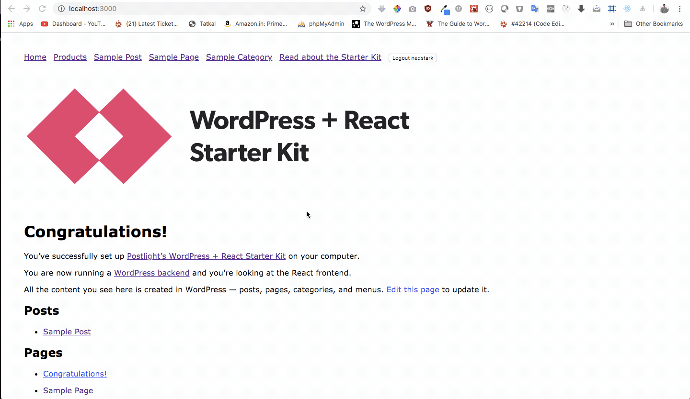

# Headless WP Starter

## Installation :pointer:

1. Install Docker
2. `git clone git@github.com:imranhsayed/headless-wp-starter.git`
3. `cd headless-wp-starter`
4. `docker-compose up -d`
5. Once install add this to your wp-config file ( `define('JWT_AUTH_SECRET_KEY', '&BZd]N-ghz|hbH`=%~a5z(`mR=n%7#8-Iz@KoqtDhQ6(8h$og%-IbI#>N*T`s9Dg');` )

## Demo :video-camera:


## Backend ( WordPress Dashboard ): ( http://localhost:8080/wp-admin/ )

* Start Docker for WordPress

`docker-compose up -d wp-headless`

```ruby
username: nedstark
password: winteriscoming 
```

## Front End: ( http://localhost:3000 )

* Install packages and start the front and server

`cd frontend && yarn && yarn start`

* Start Front end server

`cd frontend yarn start`

## What it does:
* Pulls the image from library/wordpress and downloads latest wordpress
* Switches to 'Postlight Headless WordPress’ theme, deletes the default themes and default plugins

#### For wp-headless:
* Installs and activates ACF, acf-to-wp-api, wordpress-importer, WP-REST-API V2 Menus, jwt-authentication-for-wp-rest-api, wp-graphql, wp-graphql-jwt-authentication, wp-migrate-db-pro, wp-migrate-db-pro-cli, wp-migrate-db-pro-media-files
* sets up mysql, php unit test
* Pulls the image from library/node,  sets up up next js

#### For Frontend
* Installs fsevents@1.2.4, react-apollo@2.4.1

## The packages/plugins used:
#### 1. wpapi npm package
 
* An isomorphic client for the WordPress REST API, designed to work with WordPress 5.0 or later. It     works both on the server or in the browser
Once an instance is constructed, you can chain off of it to construct a specific request. (Think of it as a query-builder for WordPress!)
They have an extensive API documentation

## Create a Woocommerce REST API Key

* WordPress Dashboard > WooCommerce > Settings > Advanced > REST API > Create an API Key

## Credits

* Cloned from [Poslight Headless-wp-starter](https://github.com/postlight/headless-wp-starter)

